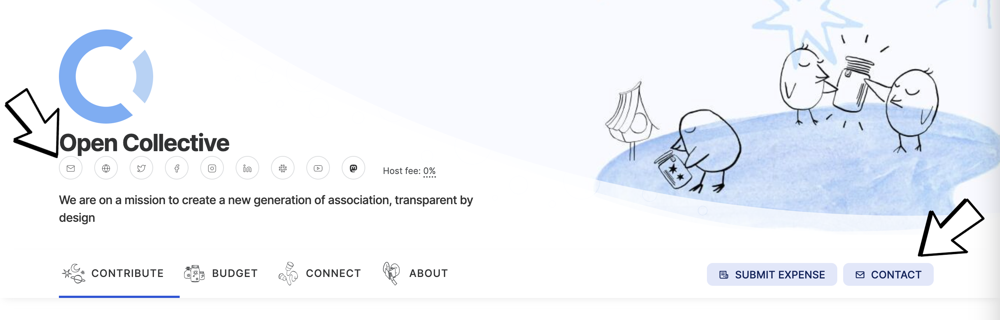

# Contact Us

### Need Assistance?

* Browse our [Help Topics](https://opencollective.com/help) or Search these Docs (🔎 in the upper right corner)
* [Contact us here](https://opencollective.com/contact): Please include links & screenshots!

### In Slack

* [Join our Slack](https://opencollective.slack.com/ssb/redirect) to reach the OC Team and the wider community
* Feel free to introduce yourself or post content related to Open Collective in [#general](https://opencollective.slack.com/archives/C0HSLRNVC). We encourage you to mention your collective or fiscal host in your profile so that other members can easily connect with you.
* Fiscal Host Specific Channels - If you’re hosted by one of our larger fiscal hosts, you can join a dedicated channel to ask questions and share information:
  * [#opensource](https://opencollective.slack.com/archives/C0RD4S62E) - Open Source Collective
  * [#ocf](https://opencollective.slack.com/archives/C7U3AD29F) - Open Collective Foundation
  * [#oc-europe](https://opencollective.slack.com/archives/C6MKYT4AY) - Open Collective Europe
  * [#nz](https://opencollective.slack.com/archives/C01PY8SNFRR) - Open Collective New Zealand
* Are you a Fiscal Host admin? Join [#fiscal-hosts](https://opencollective.slack.com/archives/CJ2ERRZQ8)
* If you need support or have questions about Open Collective, reach out to our [#community-support](https://opencollective.slack.com/archives/C6JTTA4SK) channel or [read our documentation](https://docs.opencollective.com/help/?utm\_source=Slack\&utm\_medium=Bot\&utm\_campaign=Welcome). If you need to share any private information, talk to our Support team here: [https://opencollective.com/help](https://opencollective.com/help).
* Feel free to share any [#news](https://opencollective.slack.com/archives/CT9MM6Q5A) or [#events](https://opencollective.slack.com/archives/C036P75R59R), and engage with our [#engineering](https://opencollective.slack.com/archives/C0RMV6F8C) team
* Check out [our Community Guidelines](https://docs.opencollective.com/help/about/the-open-collective-way/community-guidelines) to learn more about how we all maintain a welcoming and inclusive atmosphere.  You can report any issues by messaging [@moderators](https://opencollective.slack.com/admin/user\_groups) directly or sending an email to support.

### Contact a specific Fiscal Host or Collective?

* Visit their Open Collective page, and click the small envelope below their name or the contact button on the right-hand side.&#x20;

<figure><figcaption></figcaption></figure>

* Contact [**Open Collective Foundation**](https://docs.opencollective.foundation/about/contact-us)
* Contact [**Open Source Collective**](https://docs.oscollective.org/about/contact)
* Contact [Open Collective Europe](https://docs.opencollective.com/oceurope/about-1/contact-us)

### Find Us Elsewhere

* [Github](https://github.com/opencollective)
* [Twitter](https://twitter.com/opencollect)
* [Blog](https://blog.opencollective.com/)
* [LinkedIn](https://www.linkedin.com/company/opencollective/)
* [Mastodon](https://mastodon.opencollective.com/@opencollective)
* [Youtube](https://www.youtube.com/channel/UCdi\_-GH5nozXiMm2fH447VA)
* [Facebook](https://web.facebook.com/OpenCollect)
* [Instagram](https://www.instagram.com/opencollective/)
* Tiktok&#x20;
