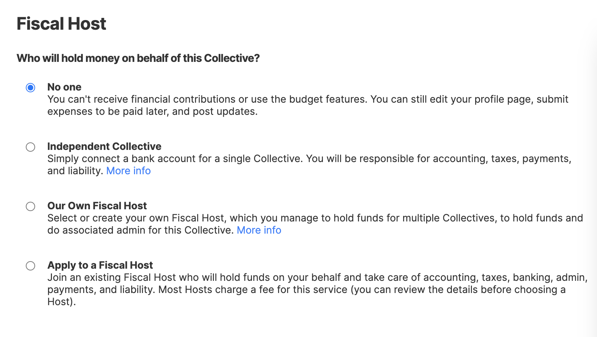

# Add Fiscal Host


With the implementation of the new [Dashboard interface](https://docs.opencollective.com/help/product/understanding-your-dashboard), we are currently in the process of updating our documentation and some pages may be out of date. Thank you for your patience. Please [contact](https://opencollective.com/contact) our support team if you need any assistance.


## Options for Fiscal Hosting

In order to raise and spend money, you'll need a bank account associated with your Collective.&#x20;

You can:

1. Join a [Fiscal Host](../fiscal-hosts/fiscal-hosts.md), who will take care of things like accounting, banking, liability, and payments (most Collectives choose this option), or
2. Plug in your own bank account as an [Independent Collective](../independent-collectives/about-independent-collectives.md), or
3. Create [your own Fiscal Host](../fiscal-hosts/become-a-fiscal-host.md) to hold funds for multiple Collectives under the umbrella of your own legal entity.

## How to add a Fiscal Host

There are different hosts that serve different missions, interest areas, and geographic. [See them all here](https://opencollective.com/hosts).

Click on the apply button on any host page, and if your project fits their criteria, they will approve it. (The apply button can sometimes be nestled under the actions button).&#x20;


If you are an open-source project with at least 100 stars on GitHub (or equivalent other websites), you can apply to create your Collective under the umbrella of the [Open Source Collective](https://opencollective.com/opensource/apply) fiscal host.


To see your Fiscal Host options, go to your Collective Page, click on the settings button and head to the **Fiscal Host** page.

* **No one:** No bank account or Host connected, not able to receive and spend money.
* **Independent Collective:** Use your personal or company bank account to hold funds for a single Collective.
* **Our Own Fiscal Host:** Run your own Fiscal Host that holds money for multiple Collectives.
* **Apply to a Fiscal Host:** Join a Host that provides this service to Collectives like you.

<figure><figcaption></figcaption></figure>

## Applying to a fiscal host

Fiscal hosts have their own application criteria, which is often based on their location, their mission or impact area and their legal status.&#x20;

Applying to a host will require that you answer some questions about your project that help the host asses whether you are appropriate for their organization.&#x20;

### Host Policies

Hosts also have policies which they will make you aware of during your application, some of these policies are enforced through the Open Collective platform including:&#x20;

#### Minimum number of Administrators

Some hosts require that you have a minimum of two of more administrators associated with your Collective. If this is the case you will be asked to invite other administrators as part of your application process:

&#x20;

