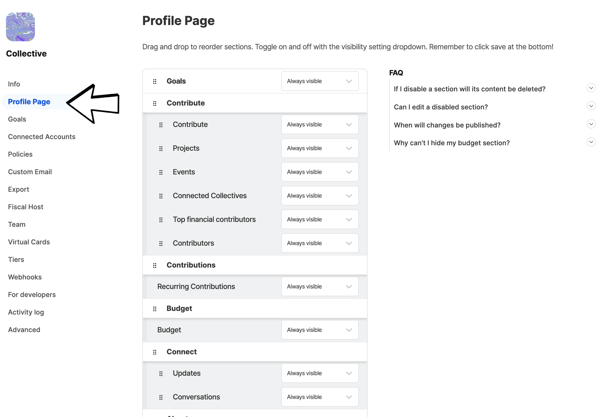
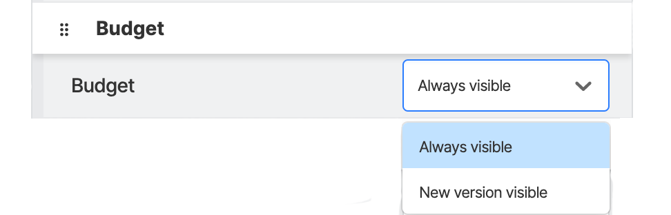

# Transparent Budget

Collectives have transparent budgets, where all transactions are automatically reported. Everyone can see where the money comes from and what it's spent on.

We have two budget views. Our [Simple budget](budget.md#simple-budget) view shows overall monetary figures and a list of expenses and contributions.&#x20;

Our [new budget visualisation](budget.md#undefined) pulls information from your expenses and contributions and showcases them with varying graphs.&#x20;

### Simple Budget&#x20;

The Budget Section on the Collectives Page shows the most recent transactions alongside - Todays Balance, Total Raised, Total Disbursed and Estimates Annual Budget.

Private information is hidden. For example, email addresses and attachments (which may contain personal information).

The expenses view shows what the Collective has spent money on. You can see individual expenses and people the budget has gone toward.&#x20;

You can click on View all expenses to view a more detailed breakdown this view also allows you to filter by Type, Payout, Period, Amount and Status. You can also filter by different tags like Engineering, Communications, Travel etc.

The transactions view shows financial contributions. You can see individual contributions and who has made the contribution.

You can click on View all transactions to view a more detailed breakdown this view also allows you to filter by Type, Period, Amount and Kind. You can also download a CSV of all transactions.&#x20;

### New Budget Visualisation&#x20;

Our new budget visualisation enables a more accessible exploration of your data through graphs and categories. This feature pulls information from your tagged expenses and your one-time and recurring contributions. These can then be filtered by different time frames and showcased with varying graphs.&#x20;

<figure><figcaption></figcaption></figure>

We recommend tagging your expenses to ensure your graphs display accurate expense data.  [Click here to learn how to tag your expenses. ](https://docs.opencollective.com/help/collectives/expenses#expense-tags)

<figure><figcaption></figcaption></figure>

This new budget visualisation tool will help your funders/contributors get a better sense of your financial well-being. Questions can now be easily answered; such as: How long has the project been actively raising money? - Is the funding consistent - How does the project currently spend its funding?

### How to switch your Budget View

\
Toggle between the two budget views by going to your page settings&#x20;

<figure><figcaption></figcaption></figure>

Select Profile Page&#x20;

<figure><figcaption></figcaption></figure>

\
Find the Budget section, you can then toggle between the two budget views and move this section on your profile page.&#x20;

<figure><figcaption></figcaption></figure>

\
Then click save

<figure><figcaption></figcaption></figure>

### Budget Calculations&#x20;

Estimated Annual Budget - It's a projection based on current recurring contributions and activity in the past year. It's counting:

* 1\) All active monthly subscriptions. Multiply by 12.
* 2\) All active yearly subscriptions.
* 3\) All one-time subscriptions in the past year.
* 4\) All inactive monthly subscriptions that have contributed in the past year.
