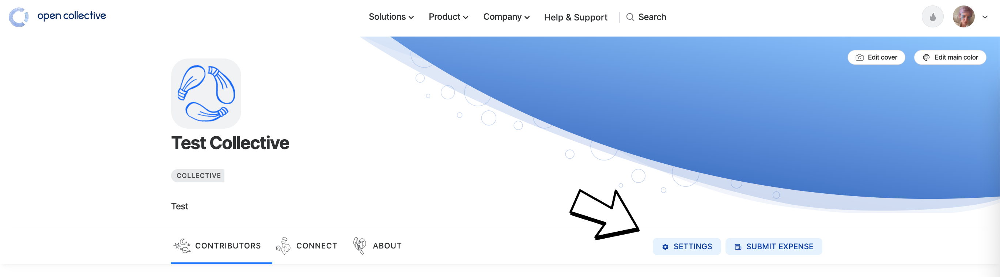

# Closing a Collective

If you want to close down your Collective, you can either archive or delete it. Either way, you first need to [zero the balance](zero-collective-balance.md).

Go to your Collective's page, click on the setting button on the right of your profile.

<figure><figcaption></figcaption></figure>

Head to the **Advanced** page to access those options.

## Delete a Collective

If your Collective does not have any transactions or financial activity, you can delete it. Deleting a Collective will remove its data, including memberships, payment methods, etc.


If your Collective has transactions associated with it, you will have to archive it. The reason we cannot delete transactions is the financial ledger must retain its accuracy and integrity. Your income is someone else's expense, and your expenses are someone else's income.


## Archive a Collective

If your Collective has transactions, you can archive it instead of deleting. This will mark the Collective as inactive and prevent any new donations. If you want to re-activate your collective at a later stage, please follow the same steps shown below and find an updated button to unarchive the collective). Note that archiving a Collective will also cancel any recurring contributions and expenses.&#x20;

