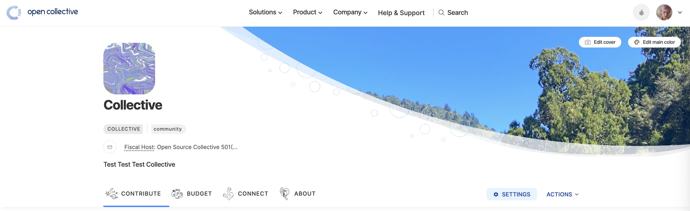
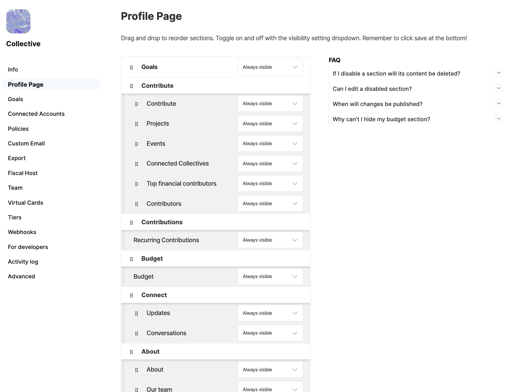

# Customize Collective

## Edit Settings

To access all settings for your Collective, click the settings button shown in the image below.

### Info&#x20;

<figure><figcaption></figcaption></figure>

The info section of the Collective settings enables you to add and change basic information about your page.&#x20;

**Display name** - Display names are public and used wherever this profile appears publicly, like contributions, comments on updates, public info on expenses, etc.&#x20;

**Short description** - This description appears at the top of your collective page.&#x20;

<figure><figcaption></figcaption></figure>

**URL slug** - the unique identifier that directs to your collectives page on Open Collective 'www.opencollective.com/yourcollectiveslug'&#x20;

**Twitter** - Link to your Twitter Account&#x20;

**Code repository** - Link to your Github Account&#x20;

**Website** - Link to your website

**Address** - Your Collectives address

**Country** - Your Collectives Country&#x20;

**Currency** - Your preferred currency&#x20;

**Tags** - Identifiers utilised by search to find your collective&#x20;

## Profile Page

Show and hide different sections on your collective page.&#x20;

<figure><figcaption></figcaption></figure>

As an admin, all sections will appear in your view, with invitations to add content.

&#x20;However, any sections without content will not appear to other users (for example, **Updates** and **About**).

## Change Logo

To update your logo image, hover over it and click on **Edit logo**, or simply drag an image file onto the logo area.


All logos are displayed on a white background, so white logos will not be visible. If you want to use a white logo, upload an image with a colored background instead of a transparent one.


## Set Main Color

Your main color determines the color of links and buttons, tier cards, and the hero header if no image is set.

Click on **Edit main color** in the header area to set the color.

## Set Cover Image

To change your cover image, click on **Edit cover**. By clicking on the image, you are able to move it around. You can also zoom in and out as you like. The optimal image size for a cover image is 2736x650.&#x20;

