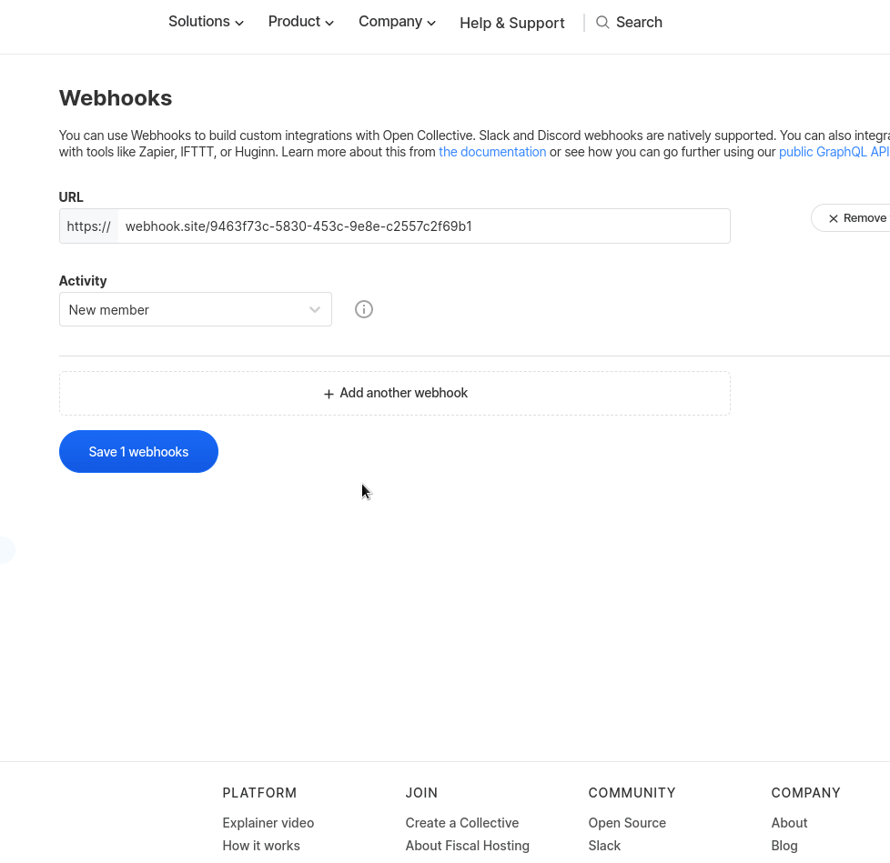

# Integrations


With the implementation of the new [Dashboard interface](https://docs.opencollective.com/help/product/understanding-your-dashboard), we are currently in the process of updating our documentation and some pages may be out of date. Thank you for your patience. Please [contact](https://opencollective.com/contact) our support team if you need any assistance.


## Webhooks (generic, Slack, Discord)

Go to your settings, click on "Webhooks" then select the type and enter the URL for your webhook. The system will automatically detect Slack or [Discord's slack-compatible](https://discord.com/developers/docs/resources/webhook#execute-slackcompatible-webhook) webhook URLs and will adapt the payloads for them.

See [this link](https://api.slack.com/messaging/webhooks#getting\_started) to learn how to create a Slack webhook, or [this link](https://support.discord.com/hc/en-us/articles/228383668-Utiliser-les-Webhooks) to learn how to create a Discord webhook.

While creating the webhook, you'll be able (in some cases) to preview the payload by clicking on the Info icon next to the activity name:

<figure><figcaption></figcaption></figure>

## Other chat integrations (Mattermost, Gitter)

For Mattermost or Gitter, first set up a webhook as described above, and then [send it to us](https://opencollective.com/support) and we'll add the hook to our platform.

## Twitter Integration

Connect your Twitter to automatically thank new supporters who contribute to your Collective! To do so, go to your Collective page, click on the gear icon, and head to the **Connected Accounts** page.

