# Events


This functionality is still in it's experimental phase.


## Create an Event

Log in to your Collective and scroll down to the Events section. Click on the **Create Event** button.

<figure>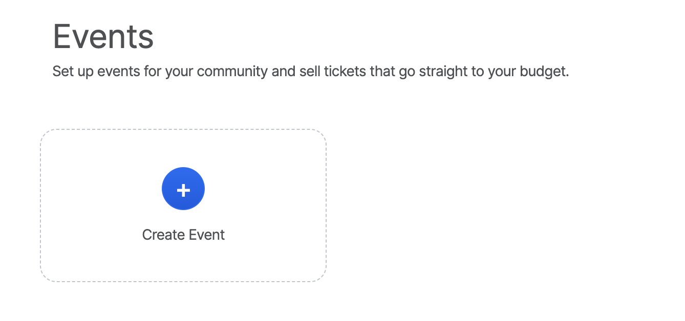<figcaption></figcaption></figure>

<figure><figcaption></figcaption></figure>

* **Name** of the event
* **Short Description:** purpose, schedule, etc. Use something short (less than 255 characters). You'll be able to set a longer description directly on the event page after its creation.
* **Start** date & time
* **End** date & time
* **URL:** the online address your event will have - very important so you don't get a [404 error](events.md#i-cant-see-my-event-listed-or-get-a-404-error).
* **Location:** the address will load a map
* **Private instructions:** These instructions will be provided by email to the participants.&#x20;

#### Add Images

You'll need to host your image somewhere and link to it with markdown syntax. Use this [Markdown cheatsheet](https://github.com/adam-p/markdown-here/wiki/Markdown-Cheatsheet#images) if you're not sure how. The basic format is:

```

```

The size of the image should be 750 px wide max.

#### Finally, click the "CREATE EVENT" button.

## Event Settings&#x20;

To access your event settings - click on the settings button on the right side of the page.&#x20;

<figure>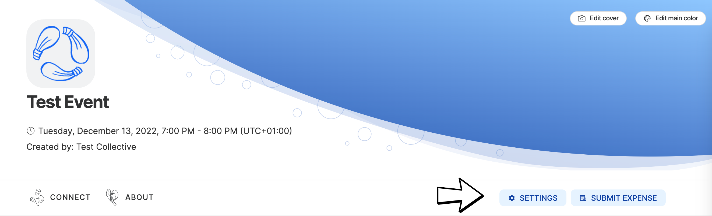<figcaption></figcaption></figure>

### Info

Edit the basic event information of your event

<figure>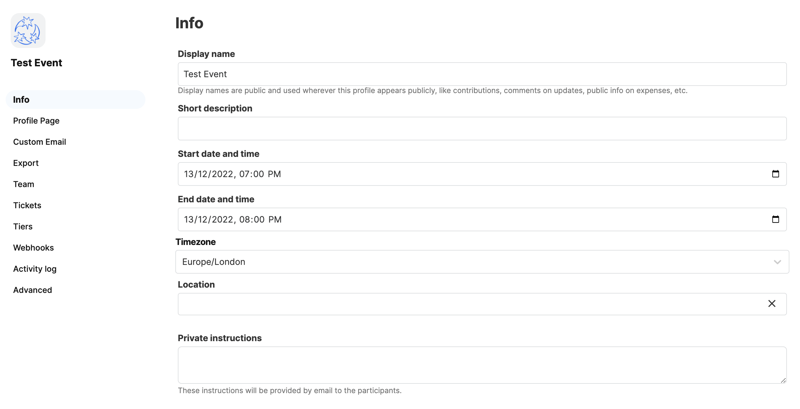<figcaption></figcaption></figure>

* **Name** of the event
* **Short Description:** purpose, schedule, etc. Use something short (less than 255 characters). You'll be able to set a longer description directly on the event page after its creation.
* **Start** date & time
* **End** date & time
* **URL:** the online address your event will have - very important so you don't get a [404 error](events.md#i-cant-see-my-event-listed-or-get-a-404-error).
* **Location:** the address will load a map
* **Private instructions:** These instructions will be provided by email to the participants.&#x20;

### Profile Page

Drag and drop to reorder sections on your event page. Toggle on and off visibility with the visibility setting dropdown.&#x20;

<figure>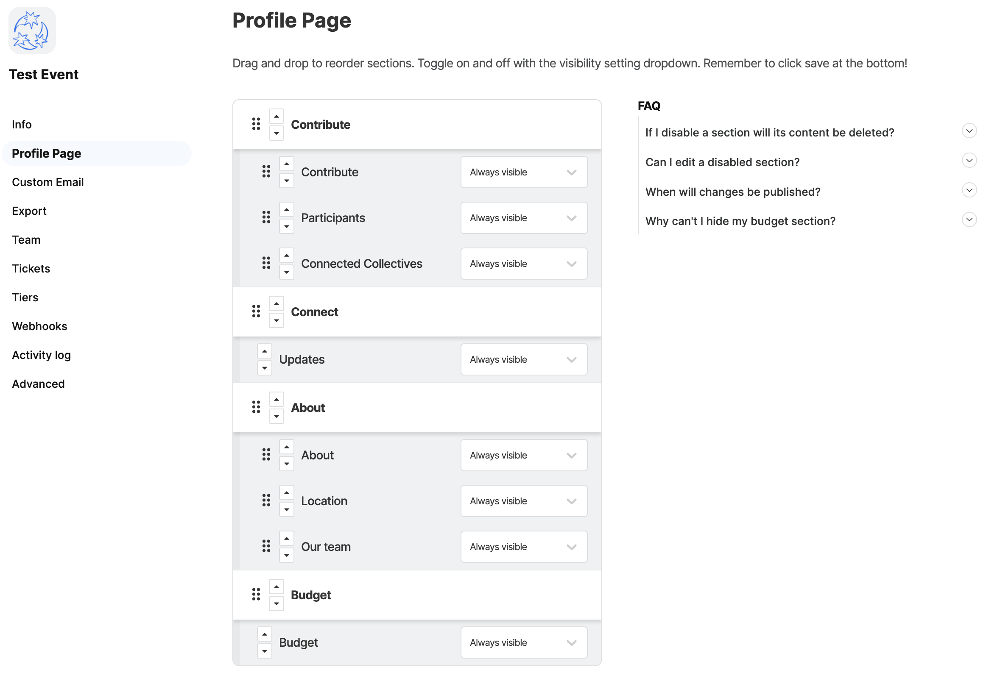<figcaption></figcaption></figure>

### Custom Email&#x20;

Add a custom message to be included in the email sent to financial contributors/

attendees of your Event

<figure>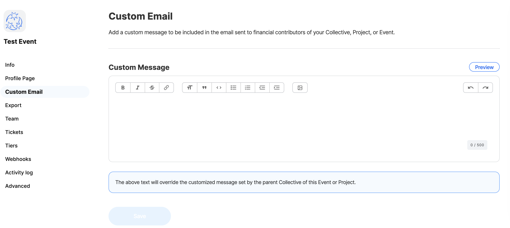<figcaption></figcaption></figure>

### Export&#x20;

Export your contributors data in CSV or JSON format

<figure><figcaption></figcaption></figure>

### Team

Events inherit the admins/team of the Collective.

### Tickets

To add tickets to your event click on the Create Ticket button on the Event Page or&#x20;

<figure><figcaption></figcaption></figure>


Click on the add another ticket button within the event settings

<figure>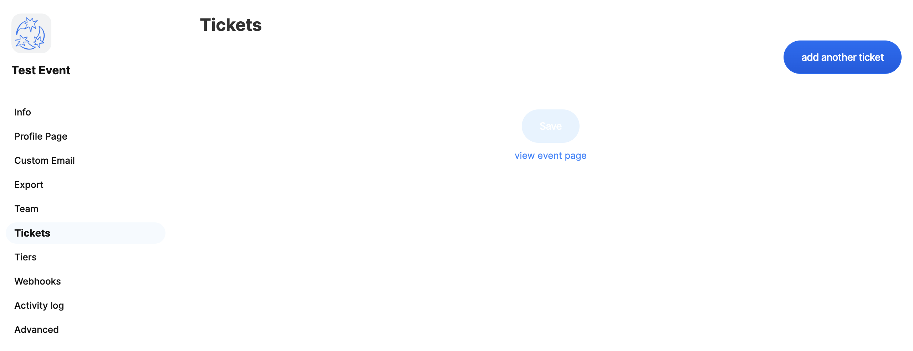<figcaption></figcaption></figure>

<figure><figcaption></figcaption></figure>

#### Type&#x20;

Ticket - allow multiple tickets per order&#x20;

#### Name&#x20;

Name of the Ticket (eg, gold sponsor, free ticket, donation, etc)

#### Description&#x20;

What the ticket includes or who it's for

#### Amount type

Fixed amount lets your define the fixed ticket amount (price)&#x20;

<figure>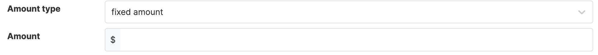<figcaption></figcaption></figure>

Flexible amount lets you define two suggested amounts, a default amount and a minimum amount

<figure><figcaption></figcaption></figure>

#### Available quantity

Define how many tickets are available. Leave empty for unlimited.&#x20;

#### Button Text&#x20;

Set a custom button text&#x20;

<figure>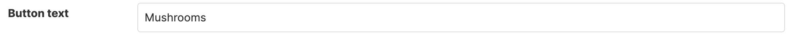<figcaption></figcaption></figure>

<figure><figcaption></figcaption></figure>

#### Goal

Define the amount you aim to raise&#x20;

<figure>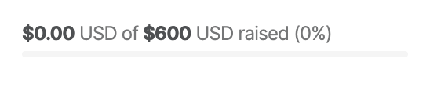<figcaption></figcaption></figure>

#### Standalone page

Create a standalone page for this tier. It's like a mini-crowdfunding campaign page that you can add a detailed description and video too, and link to directly.&#x20;

#### Want to add more tickets?

You can add more tickets with the "add another ticket" button.

<figure>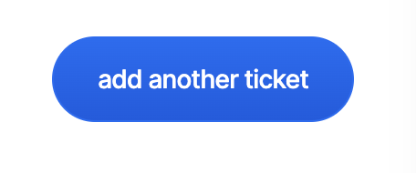<figcaption></figcaption></figure>

#### Want to remove a ticket?

Click on the remove ticket text in the top right hand corner&#x20;

<figure><figcaption></figcaption></figure>

### Tiers

Tiers can be utilised within the financial contribution section of your event. This is for people that want to give donations to your event, not purchase tickets.&#x20;

You can choose to turn on Flexible Contributions, Crypto Contributions or Create your own tiers

<figure>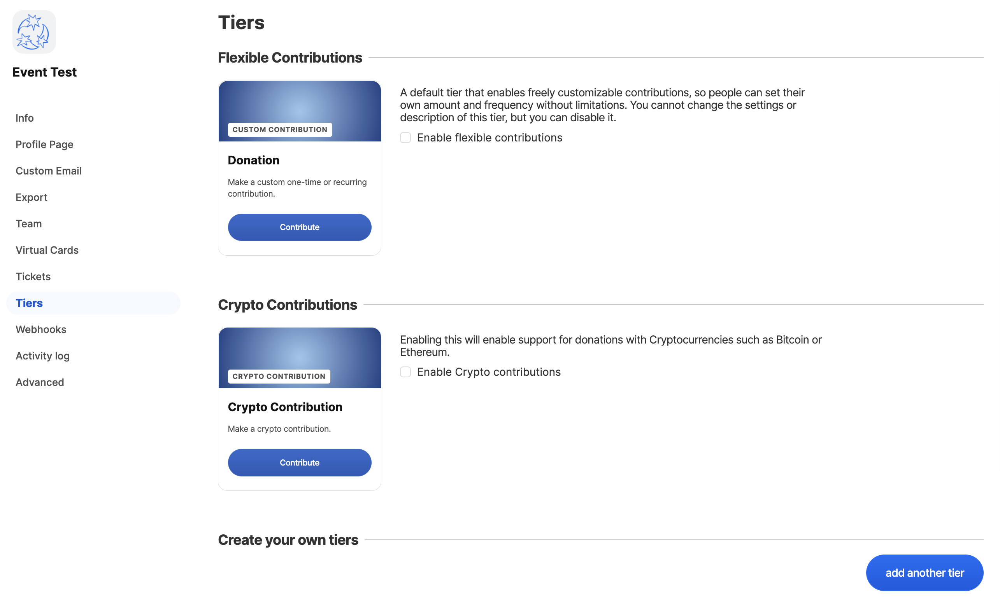<figcaption></figcaption></figure>

#### Flexible Contributions&#x20;

A default tier that enables freely customisable contributions, so people can set their own amount and frequency without limitations. You cannot change the settings or description of this tier, but you can disable it.&#x20;

#### Crypto Contributions

Enabling this will enable support for donations with Cryptocurrencies such as Bitcoin or Ethereum collectives\_events\_fixedamount\_2022-09-13

#### Create your own tiers

<figure>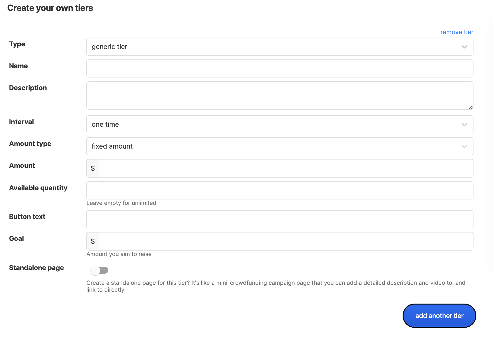<figcaption></figcaption></figure>

#### Type&#x20;

Choose between Generic tier, Membership (recurring), Service (e.g. Support), Product (e.g. T-shirt) or Donation (Gift)

<figure>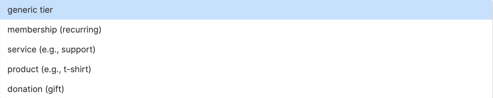<figcaption></figcaption></figure>

#### Name&#x20;

Name of the Tier&#x20;

#### Description&#x20;

purpose, schedule, etc. Use something short (less than 255 characters). You'll be able to set a longer description directly on the event page after its creation.

#### Interval&#x20;

Choose between one-time, monthly, yearly or flexible&#x20;

<figure>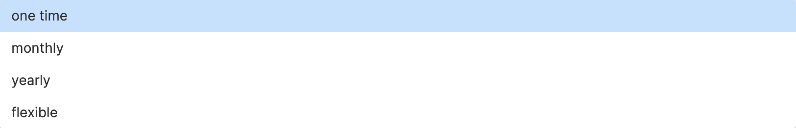<figcaption></figcaption></figure>

#### Amount&#x20;

Choose the amount&#x20;

#### Available quantity&#x20;

Select the available quantity, leave empty for unlimited&#x20;

#### Button text&#x20;

Select your custom button text&#x20;

#### Goal&#x20;

Indicate an amount you wish to raise&#x20;

#### Standalone page&#x20;

Create a standalone page for this tier. It's like a mini-crowdfunding campaign page that you can add a detailed description and video too, and link to directly

### Webhooks

You can use Webhooks to build custom integrations with Open Collective. Slack and Discord webhooks are natively supported. You can also integrate them with tools like Zapier, IFTTT or Huginn.&#x20;

<figure>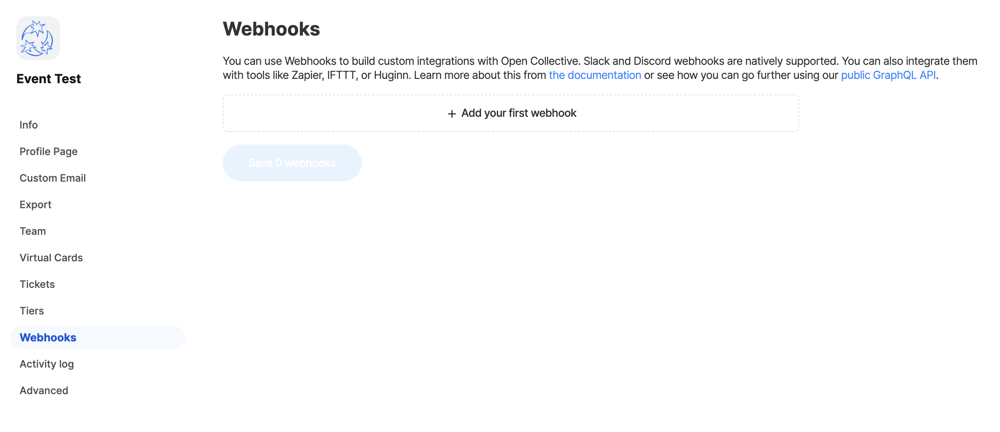<figcaption></figcaption></figure>

### Activity Log

Shows the activity that has happened on the event

### Advanced

**Empty your Event balance** - Transfer the remaining balance to the collective. The Event balance must be zero to archive the Event.&#x20;

**Archive this Event** - Archiving this Event means it will visually appear inactive and no new activity will be allowed&#x20;

**Delete this Event** - This Event will be deleted, along with all related data.&#x20;

<figure>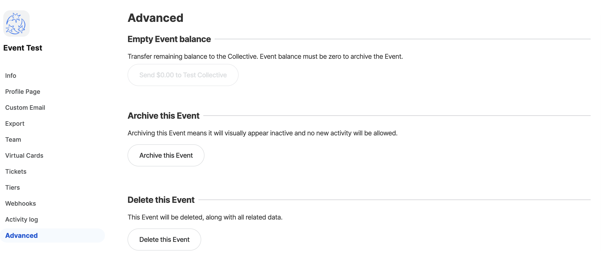<figcaption></figcaption></figure>

### **How can I set a longer description?**

You'll be able to set a longer description from your profile page. Scroll down to the about section, and either click on "Add a description" or the edit icon if one is already set.

 (1).png>)

****


## Email Attendees

If you want to email your event's attendees, you can do so by using the "Updates" feature:

1. If not done already, go to your Settings and enable Updates under Profile Page
2. Go back to your profile and click on "Create update"
