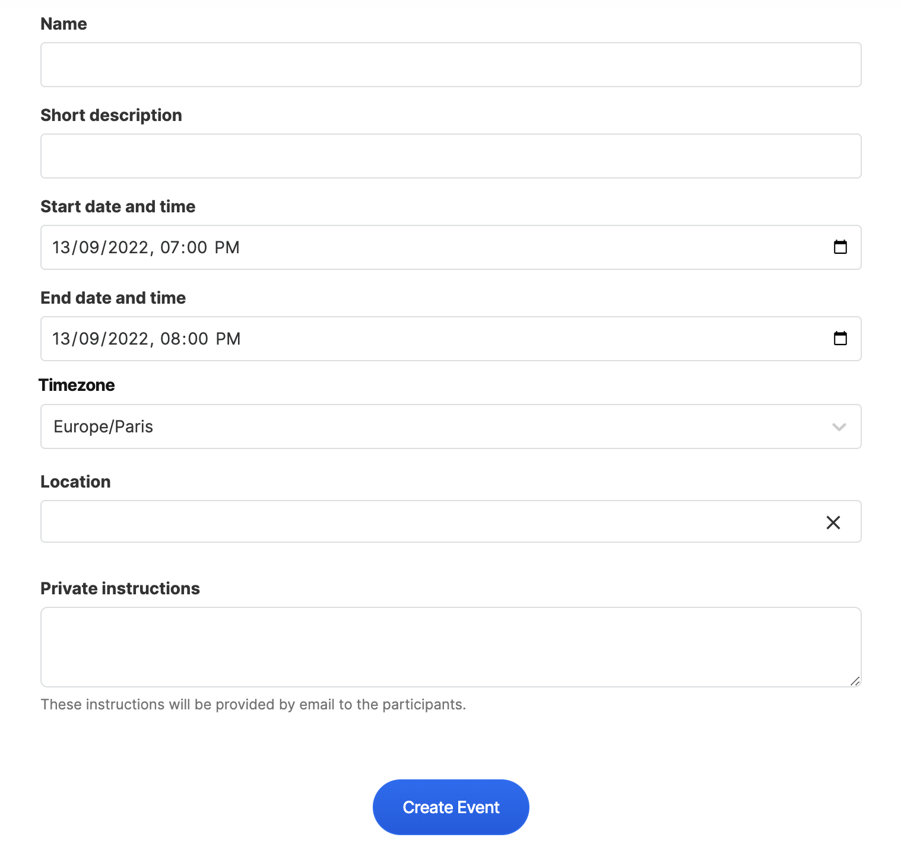

# Events


This functionality is still in it's experimental phase.


## Create an Event

Log in to your Collective and scroll down to the Events section. Click on the **Create Event** button.

<figure><figcaption></figcaption></figure>

<figure><figcaption></figcaption></figure>

* **Name** of the event
* **Short Description:** purpose, schedule, etc. Use something short (less than 255 characters). You'll be able to set a longer description directly on the event page after its creation.
* **Start** date & time
* **End** date & time
* **URL:** the online address your event will have - very important so you don't get a [404 error](events.md#i-cant-see-my-event-listed-or-get-a-404-error).
* **Location:** the address will load a map
* **Private instructions:** These instructions will be provided by email to the participants.&#x20;

#### Add Images

You'll need to host your image somewhere and link to it with markdown syntax. Use this [Markdown cheatsheet](https://github.com/adam-p/markdown-here/wiki/Markdown-Cheatsheet#images) if you're not sure how. The basic format is:

```

```

The size of the image should be 750 px wide max.

#### Finally, click the "CREATE EVENT" button.

## Event Settings&#x20;

To access your event settings - click on the settings button on the right side of the page.&#x20;

<figure><figcaption></figcaption></figure>

### Info

Edit the basic event information of your event

<figure><figcaption></figcaption></figure>

* **Name** of the event
* **Short Description:** purpose, schedule, etc. Use something short (less than 255 characters). You'll be able to set a longer description directly on the event page after its creation.
* **Start** date & time
* **End** date & time
* **URL:** the online address your event will have - very important so you don't get a [404 error](events.md#i-cant-see-my-event-listed-or-get-a-404-error).
* **Location:** the address will load a map
* **Private instructions:** These instructions will be provided by email to the participants.&#x20;

### Profile Page

Drag and drop to reorder sections on your event page. Toggle on and off visibility with the visibility setting dropdown.&#x20;

<figure><figcaption></figcaption></figure>

### Custom Email&#x20;

Add a custom message to be included in the email sent to financial contributors/

attendees of your Event

<figure><figcaption></figcaption></figure>

### Export&#x20;

Export your contributors data in CSV or JSON format

<figure><figcaption></figcaption></figure>

### Team

Events inherit the admins/team of the Collective.

### Tickets

To add tickets to your event&#x20;

collectives\_events\_export\_2022-09-13


Click on the add another ticket button &#x20;

<figure><figcaption></figcaption></figure>

### **How can I set an admin for my event?**&#x20;

Events inherit the admins of the Collective.

You can create several kinds of tickets.

* Type (supporters, sponsor, or ticket)
* Name (eg, gold sponsor, free ticket, donation, etc)
* Description (what the ticket includes or who it's for)
* Amount (price) can be free or you can charge

You can add more tickets with the "add another ticket" button.

### Tiers

### Webhooks

### Activity Log

### Advanced

## Edit or Delete an Event

1. Log in to your Collective
2. Click on the events tab
3. Click on the name of the event
4. Click "EDIT" on the event page

You will now be able to edit your event.

To delete, scroll down to the bottom and click "delete event".

### **How can I set a longer description?**

You'll be able to set a longer description from your profile page. Scroll down to the about section, and either click on "Add a description" or the edit icon if one is already set.

 (1).png>)

****


## Email Attendees

If you want to email your event's attendees, you can do so by using the "Updates" feature:

1. If not done already, go to your Settings and enable Updates under Profile Page
2. Go back to your profile and click on "Create update"
