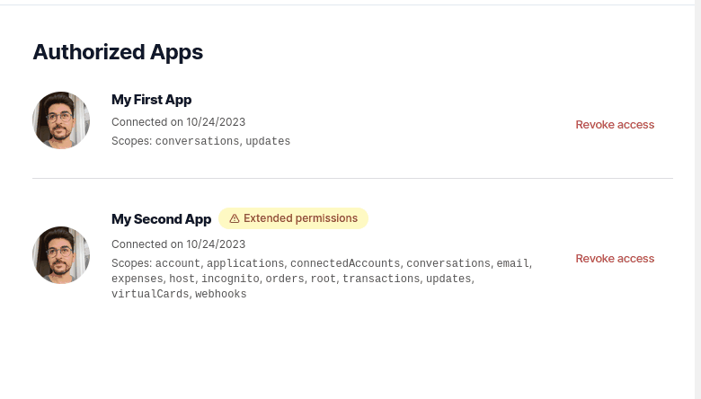

# OAuth

## Creating an OAuth app

1. Go to `https://opencollective.com/{account}/admin/for-developers` (replace `{account}` by the slug of the account you want to use as the owner of the app)
2. Click on `+ Create OAuth app` and fill in the required information\
   
3. On the success page, copy the client ID and secret for later use

.png>)

## Authorizing OAuth apps

Open Collective's OAuth implementation supports the standard [authorization code grant type](https://tools.ietf.org/html/rfc6749#section-4.1).

The web application flow to authorize users for your app is:

1. Users are redirected to request their Open Collective identity
2. Users are redirected back to your site by Open Collective with special code shared in the URL
3. You exchange the received code for an OAuth token

### 1. Request a user's Open Collective identity

> GET [https://opencollective.com/oauth/authorize](https://opencollective.com/oauth/authorize)

#### **Parameters**

<table><thead><tr><th width="150">Name</th><th width="150">Type</th><th>Description</th></tr></thead><tbody><tr><td><code>client_id</code></td><td>string</td><td><strong>Required.</strong> The client ID you copied after <a href="oauth.md#creating-an-oauth-app">creating your app</a>.</td></tr><tr><td><code>response_type</code></td><td>string</td><td><strong>Required.</strong> Only supported value for now is <code>code</code></td></tr><tr><td><code>redirect_uri</code></td><td>string</td><td>The URL in your application where users will be sent after authorization. If left out, Open Collective will redirect users to the callback URL configured in the OAuth Application settings. If provided, the redirect URL's host and port must exactly match the callback URL.</td></tr><tr><td><code>scope</code></td><td>string</td><td>A comma-separated list of scopes. If not provided, <code>scope</code> defaults to an empty list.</td></tr><tr><td><code>state</code></td><td>string</td><td>Use it to pass some state back to your application after redirecting and to protect against cross-site request forgery attacks (CSRF) by including an unguessable random string. See <a href="oauth.md#scopes-for-oauth-apps">scopes below</a>.</td></tr></tbody></table>

### 2. Users are redirected back to your site

After users accept your request, they're redirected back to your site with a temporary `code` passed as an URL query parameter as well as the `state` you provided in the previous step. The temporary code will expire after 5 minutes. If the states don't match, then a third party created the request, and you should abort the process.

Otherwise, you can exchange the `code` you received as a parameter for an access token:

> POST [https://opencollective.com/oauth/token](https://opencollective.com/oauth/token)

#### Parameters

<table><thead><tr><th width="150">Parameter</th><th width="150">Type</th><th>Description</th></tr></thead><tbody><tr><td><code>grant_type</code></td><td>string</td><td><strong>Required.</strong> The only supported value for now is <code>authorization_code</code></td></tr><tr><td><code>client_id</code></td><td>string</td><td><strong>Required.</strong> The client ID of your OAuth application (from <a href="oauth.md#creating-an-oauth-app">Creating an OAuth App</a>)</td></tr><tr><td><code>client_secret</code></td><td>string</td><td><strong>Required.</strong> The client secret of you OAuth application (from <a href="oauth.md#creating-an-oauth-app">Creating an OAuth App</a>)</td></tr><tr><td><code>code</code></td><td>string</td><td><strong>Required.</strong> The code you received as a response to <a href="oauth.md#1.-request-a-users-open-collective-identity">Step 1</a>, after the redirect)</td></tr><tr><td><code>redirect_uri</code></td><td>string</td><td><strong>Required.</strong> The URL in your application where users are sent after authorization.</td></tr></tbody></table>

#### Response

If the request succeeds, you'll receive an HTTP 200 response code with a JSON payload like:

```json
{
  "access_token": "xxxxxxxxxxxxxxxxxxxxxxxxxxxxxxxxxxxxxxxxxxxxx"
}
```

This `access_token` is what you want to use to access the API.

### 3. Use the access token to access the API

The access token allows you to make requests to the API on a behalf of a user on our public GraphQL API.

```
Authorization: Bearer {ACCESS_TOKEN}
GET https://opencollective.com/oauth/token
```

For example, in curl you can set the Authorization header like this:

```shell
curl 'https://opencollective.com/api/graphql/v2' \
  -H 'authorization: Bearer {ACCESS_TOKEN}' \
  -H 'content-type: application/json' \
  -d '{"query": "{ me { id name email } }"}'
```

## Scopes for OAuth apps

Scopes let you specify exactly what type of access you need. Scopes _limit_ access for OAuth tokens. They do not grant any additional permission beyond that which the user already has.

When setting up an OAuth App on Open Collective, requested scopes are displayed to the user on the authorization form.

### Available scopes

* `email`: Access your email address.
* `incognito`: Access your incognito account.
* `account`: Manage your account, collectives and organizations.
* `expenses`: Create and manage expenses, payout methods.
* `orders`: Create and manage contributions, payment methods.
* `transactions`: Refund and reject recorded transactions.
* `virtualCards`: Create and manage virtual cards.
* `updates`: Create and manage updates.
* `conversations`: Create and manage conversations.
* `webhooks`: Create and manage webhooks
* `host`: Administrate fiscal hosts.

## About 2FA

By default, OAuth apps are not allowed to use Two Factor Authentication (2FA) and thus cannot use protected queries and mutations (e.g. `payExpense`, `removeHost`, ...etc.) for accounts with 2FA setup. If your app needs these permissions, reach out to us on [Discord](https://discord.opencollective.com) (in the `#api` channel) or [contact support](https://opencollective.com/contact), and we'll enable it manually.

Once allowed for 2FA, your app will show a special message for users connecting with 2FA to let them know that they're giving this special permission:

&#x20;&#x20;

<figure><figcaption><p>Connect OAuth app authorization screen</p></figcaption></figure>

<figure><figcaption><p>Authorized apps screen</p></figcaption></figure>

To know whether the 2FA permission has been granted to your app, go to the application settings in your workspace and look for the warning at the top:

<figure><figcaption></figcaption></figure>
