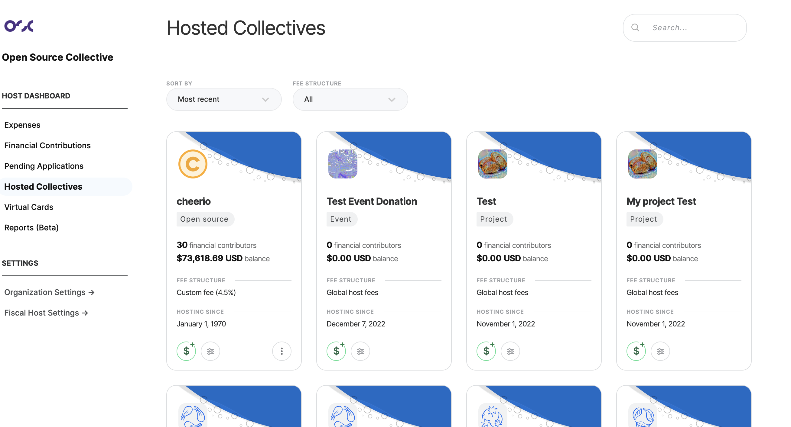
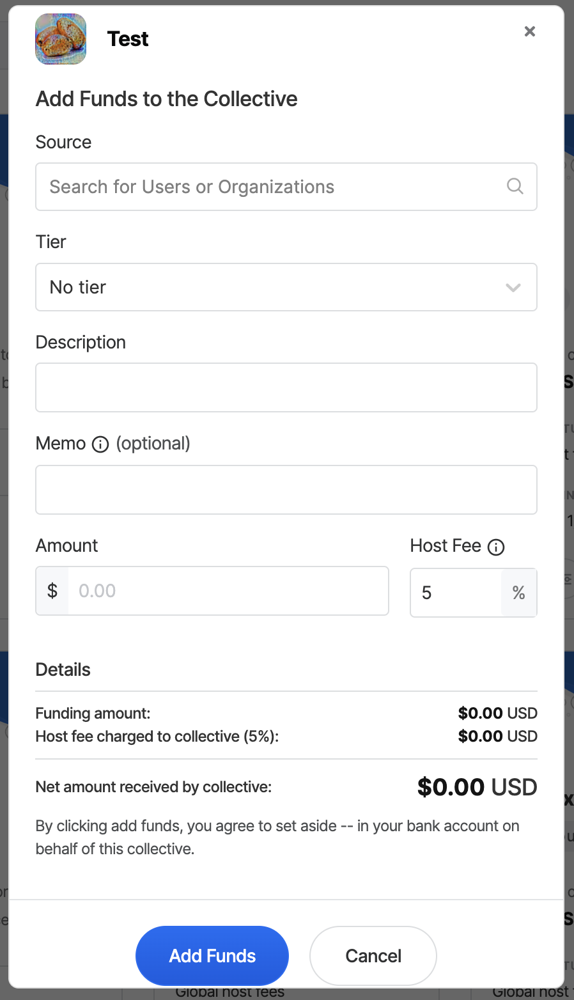
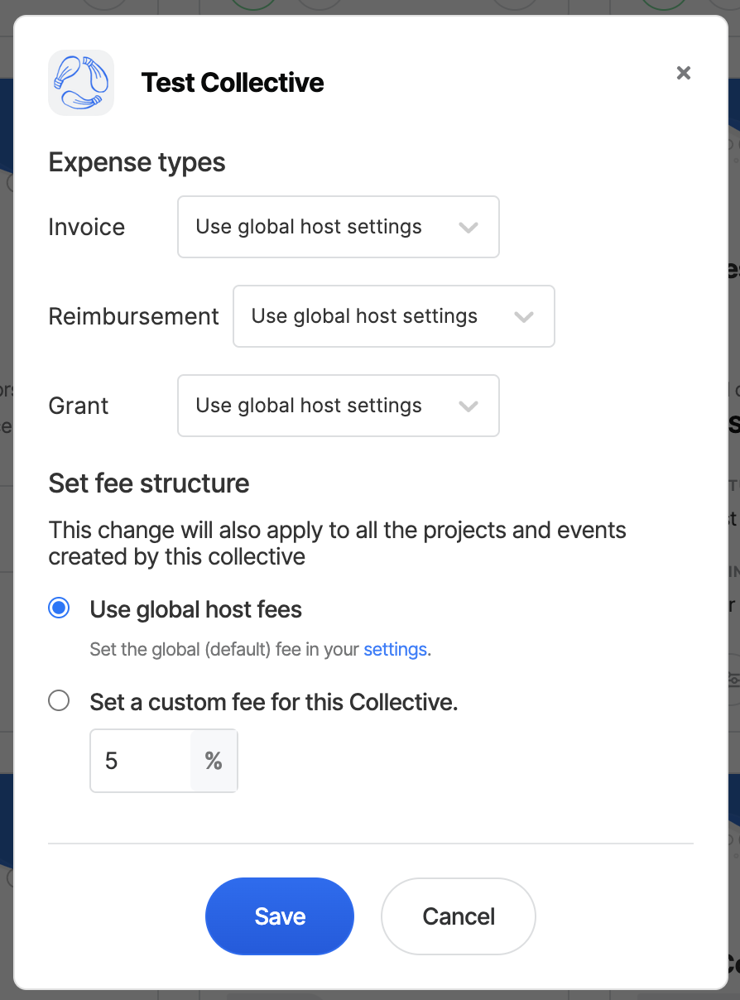
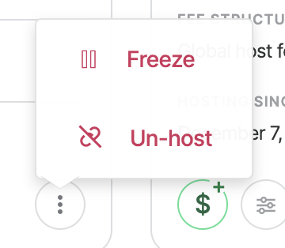
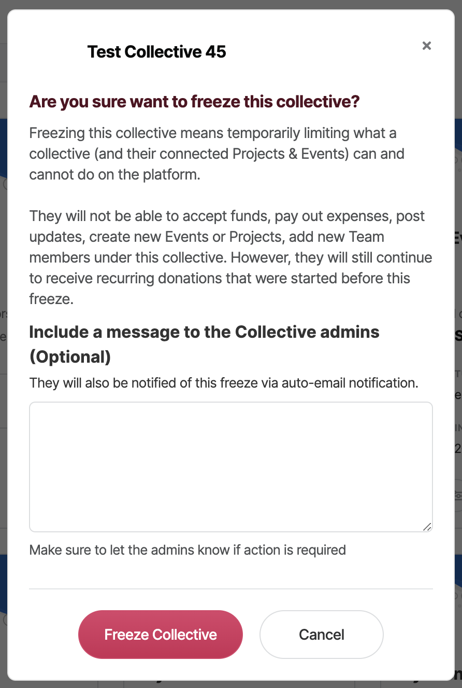
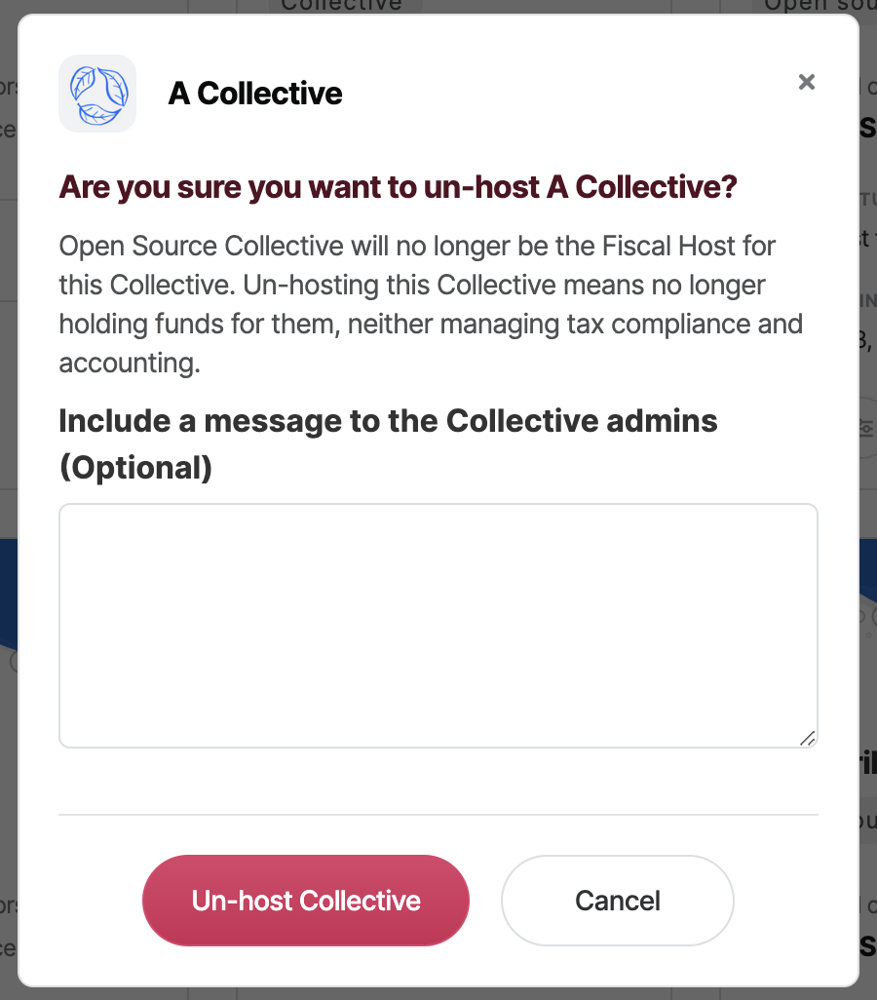
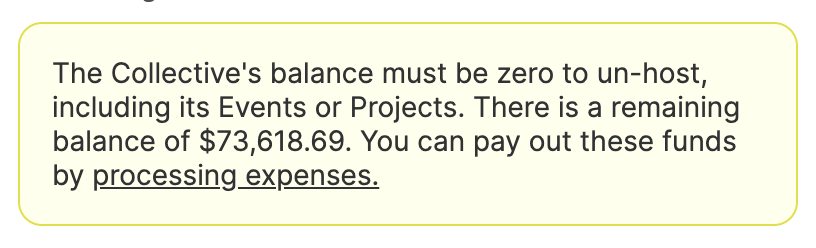

# Hosted Collectives

You can access a list of all your hosted Collectives by clicking on the **Hosted Collectives** tab.&#x20;

#### **Search**&#x20;

Either find the collective listed on the page or look for them by name via the search bar.&#x20;

#### **Filters**&#x20;

Using the filters at the top of the page, you can sort them by the period of time you've hosted them - most recent and oldest. You can also filter them by fee structure: by **global host fee** or **custom fee**.

<figure><figcaption></figcaption></figure>

### **Add Funds**

1. Click on the Add Funds button. Pictured below.&#x20;

<figure><figcaption></figcaption></figure>

2\. Fill in the required information to add funds to your Hosted Collective.&#x20;

<figure><figcaption></figcaption></figure>

### **Account Settings** &#x20;

1. Click on the settings button. Pictured below.&#x20;

#### **2.** This opens the Collective Settings panel

<figure><figcaption></figcaption></figure>

#### **Expense Types**&#x20;

Use the Global host settings or Enable or Disable Invoices, Reimbursements or Grants.&#x20;

#### **Set Fee Structure**

You will be prompted to either choose your global fee structure or to create a custom fee for this specific Collective.&#x20;

### More Options

As an added security measure/compliance option for fiscal hosts, their Admins can now freeze or un host a collective- this may be useful for compliance reasons, violations of terms, or if a collective wants to leave but hasn’t removed the fiscal host themselves already.

1. Click on the three dots to view more options.&#x20;

2\. This then gives you the option to un-host or freeze the collective.&#x20;

<figure><figcaption></figcaption></figure>

#### **Freezing a Collective**&#x20;

Freezing a Collective means temporarily limiting what a collective (and their connected Projects & Events) can and cannot do on the platform.&#x20;

Freezing a Collective will block all financial activity within that Collective. They will not be able to accept funds, pay out expenses, post updates, create new Events or Projects, or add new Team members under this collective. However, they will still continue to receive recurring donations that were started before this freeze.&#x20;

Contributions and expenses will be removed from the Collective's public profile, and admins will be informed of why the action was taken.&#x20;

<figure><figcaption></figcaption></figure>

#### Unhosting a Collective&#x20;

We've also added the ability to un-host a collective, which can be used to free a Collective to choose another host or to become an [independent collective](https://docs.opencollective.com/help/independent-collectives/about-independent-collectives).&#x20;

* This Fiscal Host will no longer manage money on behalf of the Collective.
* Any active recurring PayPal contributions or Virtual Cards will be cancelled.
* Unhosted collectives can then apply to a different fiscal host or become an [Independent Collective](https://docs.opencollective.com/help/independent-collectives/about-independent-collectives).
* Valid Stripe configurations (either through the Fiscal Host or via an IC) by the time we trigger the recurring contributions (beginning of the month) will be properly charged.
* Stripe recurring contributions are charged are able to be transferred to a new host. If the collective has a new host, they continue as usual. If they don't, the contribution will be cancelled.

<figure><figcaption></figcaption></figure>

Before un-hosting, a Collective's [balance must be zeroed](https://docs.opencollective.com/help/collectives/collective-settings/zero-collective-balance) by paying expenses, making contributions to other Collectives or gifting the balance to the host.

<figure><figcaption></figcaption></figure>

#### Steps to unhost a Collective (if they want to join another Fiscal Host)

1. The collective will make a one-time donation to their new fiscal host in the amount of the balance.
   1. Make sure _"The payee is covering the fees"_ is checked when paying the Expense so the Collective can empty the balance precisely to the cent.
2. The collective admin will need to update the collective's status on the platform to ‘un-host’ it from their current Fiscal Host.
3. The collective admin will need to apply to the new Fiscal Host.
4. The new Fiscal Host will add them to their hosted collectives and reallocate the balance via ‘add funds’ to the collective.

