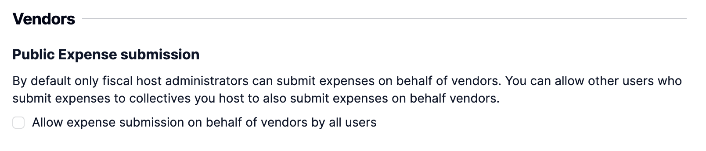

# Vendors

A vendor represents an external entity that fiscal hosts can attribute contributions or expenses to. Vendors have no public profile and are only able to be created and edited by Fiscal Host Admins.

\
Navigate to your Fiscal Host Dashboard and select Vendors.&#x20;

.png>)\

### Review existing Vendors

Utilize our potential vendor tool to transform any past organizations into vendors and contribute to a cleaner platform.&#x20;

These are organizations that any admin of your fiscal host is also an admin of. They have been used to submit an expense to either your fiscal host or any of your collectives.

### Create a vendor

You can create a vendor by clicking on “Create Vendor”

<figure><figcaption></figcaption></figure>

You will then be prompted to provide the following vendor information.&#x20;

<figure><figcaption></figcaption></figure>

* Image (optional)
* Vendors Name&#x20;
* Vendors Legal Name (optional)
* Tax Form (optional)
  * Tax Form URL (optional)
* Tax Identification&#x20;
  * Identification System (optional)
  * ID Number (optional)
* Mailing Address (optional)
* Contact Name (optional)
* Contact's email (optional)
* Payout method (optional)
* Notes (optional)


Automatic tax form collection is not active by default for Vendors. When creating a Vendor this information needs to be manually provided.&#x20;


### Edit and update a vendor

Click on an existing vendor to call up a side-drawer that will display the current vendor information.

To edit the vendor details click on Edit Vendor

When you are done editing click on Update Vendor.&#x20;

### Archive/unarchive a Vendor

Click on the three dots to the right of the Vendor and select the Archive button.

You can view all archived vendors in the archived tab. Within this view you can unarchive vendors.&#x20;

### Assign contributions to vendors

When creating contributions (through either added funds or expected funds) you can attribute the contribution to a vendor by typing in the vendors name.&#x20;

<figure><figcaption></figcaption></figure>

You can also create a new vendor by simply entering a vendor name and clicking Create Vendor.&#x20;

You can add additional vendor information via the Vendor settings in your fiscal host dashboard.&#x20;

### Submit an expense on behalf of a vendor

When submitting an expense you can attribute it to a vendor by typing in the vendors name. Only vendors with a payment method will be shown.&#x20;

You will not be prompted for a payment method. The payment method that is listed for the vendor in the vendor settings will be used to process the payment.

### Enabling other expense submitters to submit expenses on behalf of vendors

By default, only fiscal host admins are able to submit expenses to vendors. However, you can enable expense submitters to also submit expenses to your vendors.&#x20;

To enable this, go to the Fiscal host dashboard, settings, Policies. There you will find an option to enable others (users who are not fiscal host admins) to submit expenses to vendors.&#x20;

<figure><figcaption></figcaption></figure>

If this is enabled expense submitters will be able to choose a vendor from a list of the vendors that have a payment method.


Vendors may not always have a payment method attached due to being used for incoming contributions. In order to payout an expense this payment information will need to be added by a Fiscal host admin.


If a expense submitter encounters a new vendor they have to reach out to their fiscal host to ask that the vendor be created.

