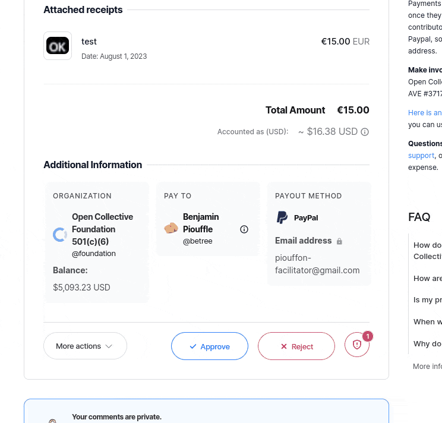
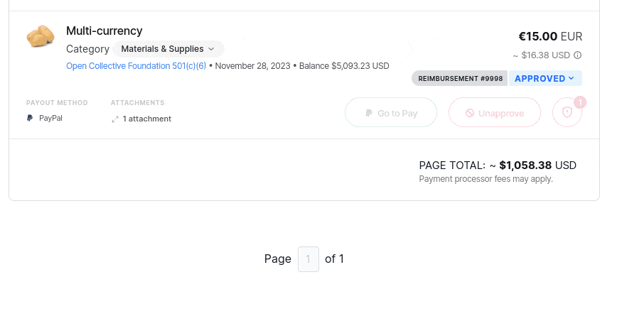

# Accounting Categories

## Configure a Chart of Accounts

As a fiscal host admin, you can define your chart of accounts by navigating to **Dashboard > Settings > Chart of accounts**. The table will let you add, remove, and edit entries.

* `Category Kind`: Indicate whether the Chart of Accounts is for Expenses or Contributions
* `Host Only`: Only display the category to Host Admins
* `Expense Types`: Indicate under what expense types the category will show i.e All expenses, Virtual Card Charge, Grant, Invoice, Reimbursement, Settlement, Unclassified
* `Category Name`: A name for you to identify the accounting category
* `Friendly name`(optional): An alternative name to show to expense submitters and collective admins in case the one from your chart of accounts is not clear enough
* `Accounting Code`: The unique accounting category code from your Chart Of Accounts. This code won't be displayed to expense submitters and collective admins
* `Instructions`: Specify further information to help with the categorization process.

<figure><figcaption></figcaption></figure>

## Contribution Categorization

Contribution categorization can be assigned by fiscal host admins to added funds & expected funds. &#x20;

<figure><figcaption></figcaption></figure>

Submitters can still select "I don't know" if they are unsure about the contribution category.

## Expense Categorization&#x20;

Expense categorization policies allow you to control how expense categories are assigned to expenses. These policies can be configured by navigating to **Dashboard > Settings > Policies > Expense categorization**.

<figure><figcaption></figcaption></figure>

**Require expense submitters to select a category when submitting an expense:**

If this policy is enabled, expense submitters will be presented with an input field (required) to choose an expense category before submitting the expense. This helps ensure that expenses are properly categorized from the outset.

Submitters can still select "I don't know" if they are unsure about the contribution category.&#x20;

<figure><figcaption></figcaption></figure>

**Require collective admins to verify expense categories when reviewing and approving expenses:**

This policy introduces an additional layer of review for expense categorization by requiring collective admins to verify and potentially modify the expense category during the expense approval process. When enabled, collective admins will see an input field in a new confirmation modal that appears when approving the expense. This additional review step can enhance the accuracy of expense categorization.

<figure><figcaption>
Accounting category modal for collective admins approving an expense
</figcaption></figure>

## Editing the category of an expense (as a host admin)

As a host admin, you can change an expense category regardless of its status. This can be done from the expense page or any expenses list by clicking the category pill:

<figure><figcaption></figcaption></figure>

When adjusting the accounting category this will trigger an educational email to be sent to the expense submitter or collective admin who initally selected the incorrect category. These emails are bundled and triggered every Monday. Here are some examples:&#x20;

**Single expense submitted:**&#x20;

<figure><figcaption></figcaption></figure>

**Single expense approved:**&#x20;

<figure><figcaption></figcaption></figure>

**Multiple Expenses Submitted:**&#x20;

<figure><figcaption></figcaption></figure>
