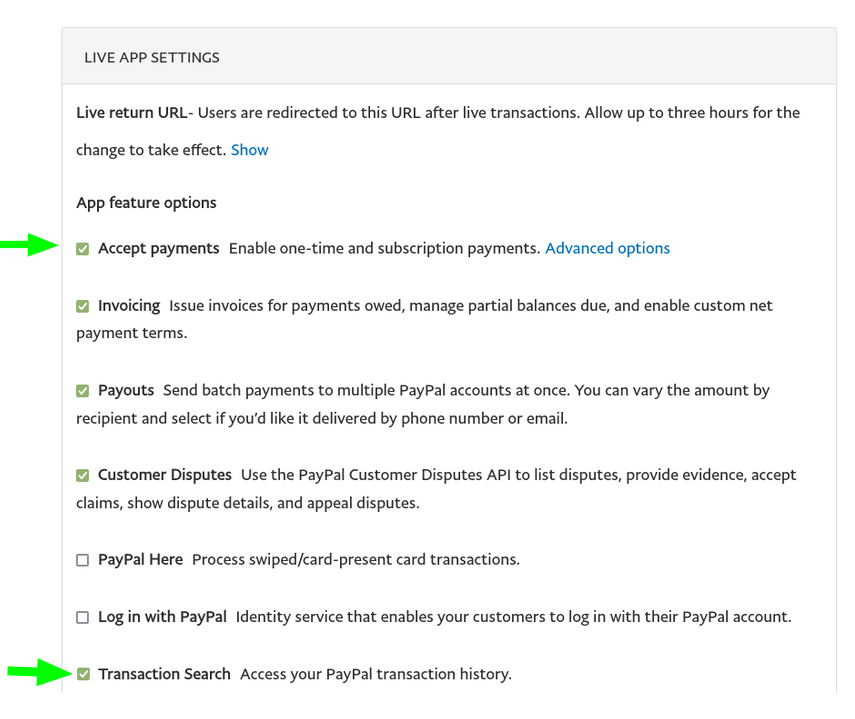

# Connect external accounts

## Connecting a Twitter account

Click on **Connect Twitter**. You will be prompted to either directly authorize Open Collective to access your account or to log in and authorize it.

Connecting your account will provide you a few automation options based on how many financial contributors Collectives you host have reached:

To use a template parameter, put it in brackets like this: `{collective}`. Here are the parameters supported by each template:

<table><thead><tr><th>Parameter</th><th width="240.33333333333331">Templates</th><th>Description</th><th>Example</th></tr></thead><tbody><tr><td><code>backerTwitterHandle</code></td><td>New financial contributors</td><td>Twitter Handle of the contributor without the <code>@</code> prefix (can be empty)</td><td><code>myUsername</code></td></tr><tr><td><code>amount</code></td><td>New financial contributors</td><td>Contribution amount with the currency</td><td><code>$10.00</code></td></tr><tr><td><code>collective</code></td><td>Ten contributors Fifty contributors One hundred contributors </td><td>Either the collective name or, if set, the Twitter handle prefixed with an <code>@</code></td><td><code>@babel</code></td></tr><tr><td><code>topBackersTwitterHandles</code></td><td>Ten contributors</td><td>Top 10 contributors names or handles</td><td>Facebook, @airbnb, company3, joe, @anotherAccount, anotherAccount2, anotherAccount3, anotherAccount4, anotherAccount5, anotherAccount6, +6</td></tr></tbody></table>

## Receiving contributions through PayPal


This feature is currently in **beta**, meaning it's still being tested. To turn on PayPal contributions, [email support](mailto:support@opencollective.com).


### Fees

Payment processor fees charged by PayPal will be automatically deducted. If any platform tips or platform share is paid through PayPal, it will go to your account and will be paid later, via the monthly settlement expense.

### Connecting PayPal

If you're already in the beta test group, you can follow these instructions:

*   [ ] Create a new PayPal app

    * Open [PayPal's Developer](https://developer.paypal.com/developer/applications/) page and Log In.
    * In _My Apps & Credentials_ page, select the **Live** environment, and click in _Create app_.

    .png>)

    * Name this App after Open Collective, this way you'll always remember where this token is being used.
    * Click _Create App._

<figure><figcaption>
To receive contributions, enable "Accept payments" and "Transactions search"
</figcaption></figure>

* [ ] Then scroll down to "Live App Settings" and make sure "**Accept payments"** and **"Payouts"** are checked
* [ ] Now, copy the necessary information to Open Collective.
  * Open a new tab and go to [Open Collective](https://www.opencollective.com).
  * Open your Host collective settings page and click in the _Receiving Money_ option in the menu.
  * Copy and paste _Client ID, Secret_ in the respective fields, leave Webhook ID empty.
  * Click _Connect PayPal._
