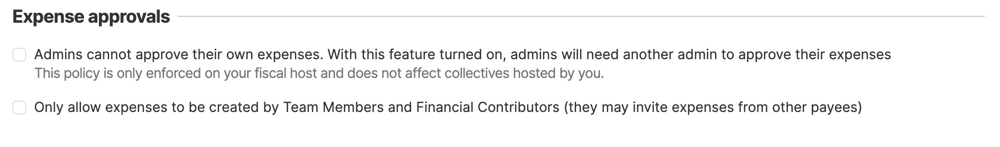
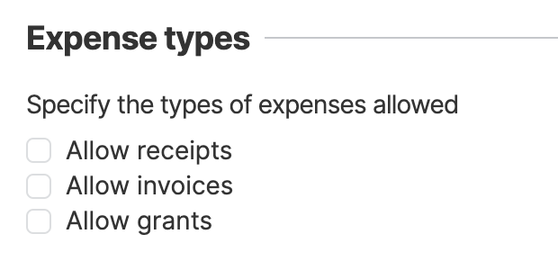
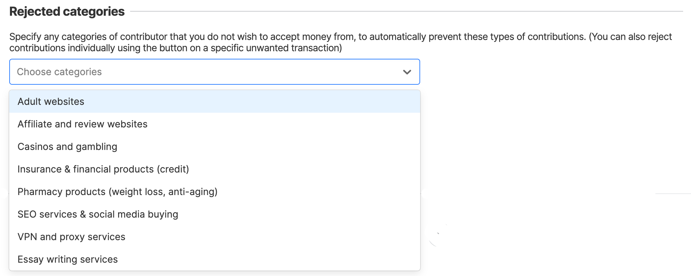

# Policies

## Required Admins

You can use this policy to enforce the minimum number of admins that a collective needs in order to be accepted by your host.

In order to do so, simply select the number of admins you want to enforce. To turn it off, select _Do not enforce a minimum number of admins_.

.png>)

Note that, after setting a minimum number of admins **you won't be able to approve Pending Applications** from collectives that do not have enough admins. You'll be able to **open an exception** for collectives that already invited enough admins, even though these invitations are still pending.

 (1).png>)

 (1).png>)

It is also possible to automatically prevent these collectives that have pending admins from receiving contributions with the freeze feature:

.png>)

In this scenario, if you decide to open an exception to a collective that still doesn't satisfy the minimum number of admins, you'll make sure they only start to raise funds after they have enough signed-up admins.

## Expense Approvals&#x20;

Set rules for expense approval.&#x20;

<figure><figcaption></figcaption></figure>

## Expense Types&#x20;

Specify the types of expenses allowed for all the collectives you're hosting.

<figure><figcaption></figcaption></figure>

If you wish to customise these options for specific collectives head to the [Hosted Collectives](../fiscal-host-dashboard/hosted-collectives.md) section.

<figure><figcaption></figcaption></figure>

## Rejected categories

<figure><figcaption></figcaption></figure>
