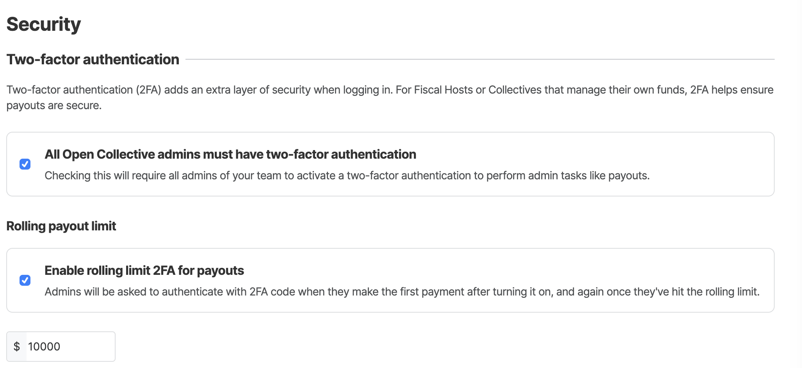

# Security

Fiscal Hosts can opt-in to enforce 2FA for all of their admins. Any attempt at triggering admin operations or visiting the admin pages will be blocked until the admins enable 2FA on their profiles. A rolling payout limit can also be set so that 2FA is triggered when this limit is met. \
\
Projects and events inherit the 2FA settings from their parents.

### How to enforce 2FA for all admins and set your rolling payout limit&#x20;

#### 1. Go to your fiscal host page&#x20;

#### 2. Click on ADMIN on the right-hand side&#x20;

#### 3. Click on Organization Settings

#### 4. Click on Security

#### 5. Check All 'Your Fiscal Host' admins must have two-factor authentication and/or set a rolling limit 2FA for payouts&#x20;

<figure><figcaption></figcaption></figure>

**6. Click Save**

<figure><figcaption></figcaption></figure>

**When visiting admin pages without 2FA, admins will be prompted to enable it**

