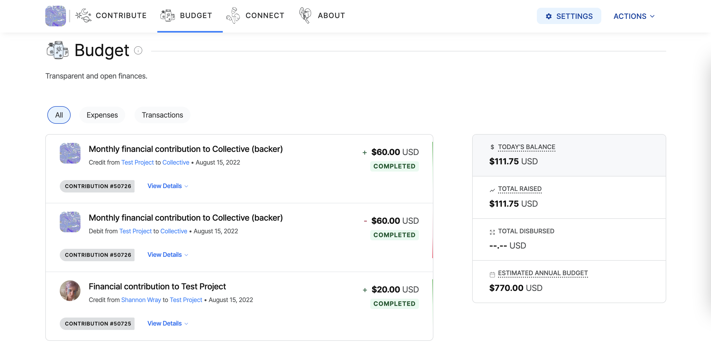
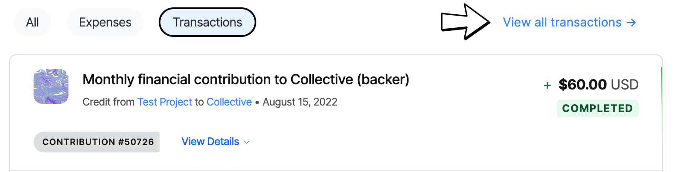
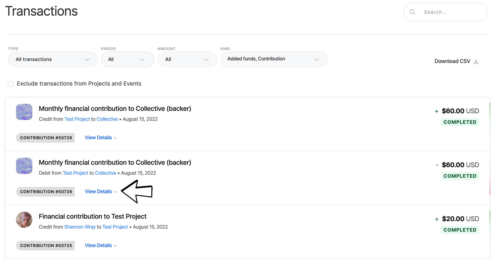
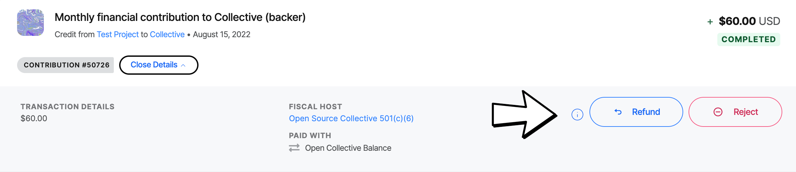
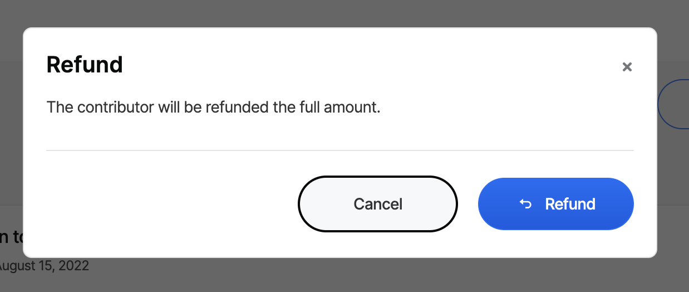

# Refunds

Collective admins are able to approve refunds for up to 30 days from the date the donation was made, as long as the payment provider supports the transaction.\
\
After that point, donations can only be refunded by Fiscal Host admins.


If you are not the admin, contact your fiscal host (or [Open Collective support](https://opencollective.com/contact) if your host is managed by Open Collective).


## **To refund a donation:**

Go to the Collective page and head to the **Budget** section.

<figure><figcaption></figcaption></figure>

Click on the Transactions Tab and then **View all transactions**.

<figure><figcaption></figcaption></figure>

Find the transaction you want to refund on the list and click on **View Details**.

<figure><figcaption></figcaption></figure>

You will find a **refund** button right next to the transaction details.

<figure><figcaption></figcaption></figure>

Click on it and confirm the operation.

<figure><figcaption></figcaption></figure>
