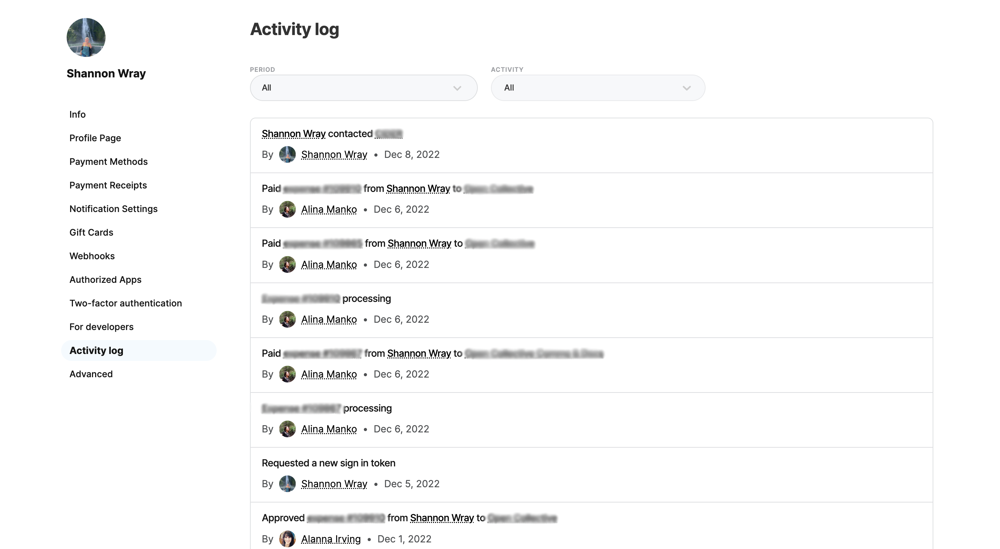
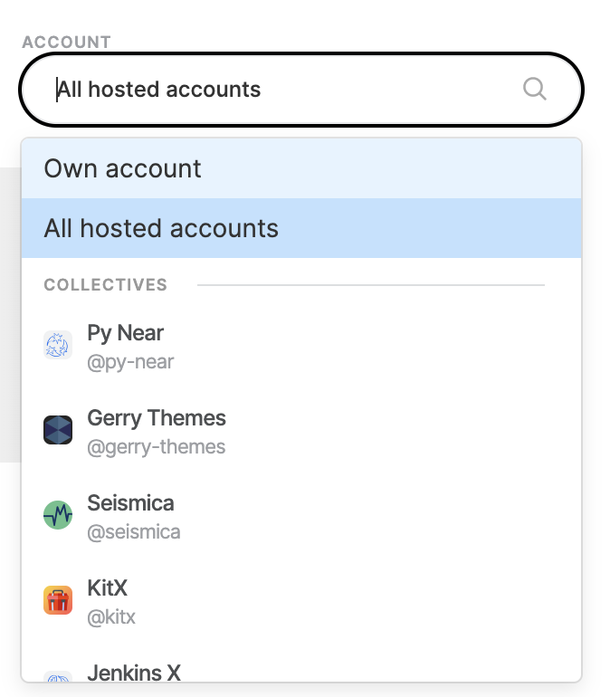

# Activity Log


With the implementation of the new [Dashboard interface](https://docs.opencollective.com/help/product/understanding-your-dashboard), we are currently in the process of updating our documentation and some pages may be out of date. Thank you for your patience. Please [contact](https://opencollective.com/contact) our support team if you need any assistance.


The Activity Log gives you the ability to track activities happening through your user profile, collective or fiscal host.&#x20;

You can access your Activity log via your Account Settings, Collective Settings or Fiscal Host Settings.&#x20;

**Click on Activity log within your settings**&#x20;

***

<figure><figcaption></figcaption></figure>

You can then filter the activity by Period or Activity.&#x20;

When viewing from a Fiscal Host account, you can also filter by Account. This allows you to view the activity of your fiscal host, all of your hosted collectives or a specific collective.&#x20;

<figure><figcaption></figcaption></figure>
