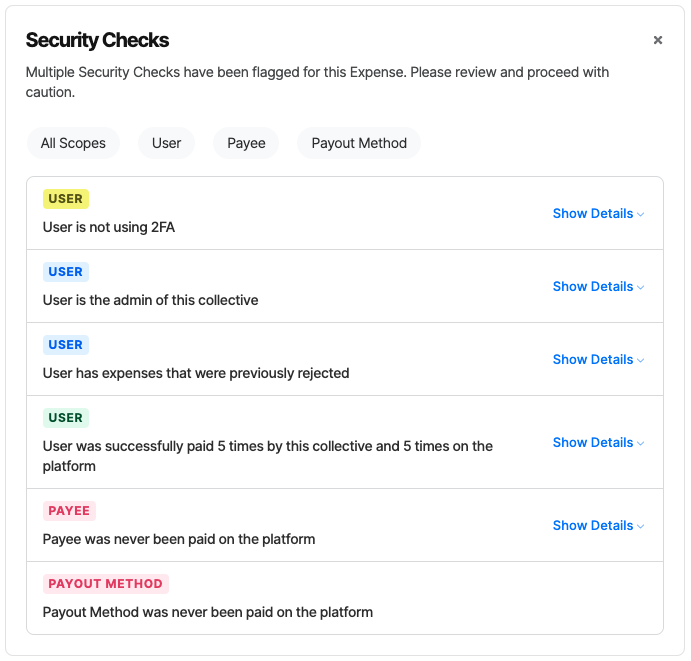

# Transaction Pairs, Groups & Perspectives

## Transaction Pairs

Transactions are always created in complementary pairs: a credit transaction and a debit transaction. For example, when Contributor A makes a contribution to Collective B, two transactions are created:

<figure><figcaption></figcaption></figure>

Or when an expense is paid from Collective B to Payee C, two transactions are also created:

<figure><figcaption></figcaption></figure>


#### Not quite Double Entry Book Keeping

Though the “transactions pairs” is a fundamental ledger pattern and it may sound like it is compatible with double entry book keeping, it isn’t.


## Transaction Groups

Usually transactions are created in groups that have a shared context. For example, when a contribution is made by Contributor A via Stripe to Collective B that is hosted by Fiscal Host C the following transaction group will be created:

1. A pair of CONTRIBUTION transactions.
2. A pair of PAYMENT PROCESSOR FEE transactions.
3. A pair of HOST FEE transactions

<figure><figcaption></figcaption></figure>

## Ledger Perspectives

Different users sees a different perspective of the same ledger. The perspective a user sees depends on the account through which they are looking at the ledger. Typically each account sees only transactions related to it. Fiscal hosts are an exception since they see both their own transactions and the transactions of the collectives they host.In the above contribution example, the contributor will see just one transaction - their contribution debited from their account:

<figure><figcaption></figcaption></figure>

A collective admin will see three transactions which correctly represent the contribution and two fees - resulting in a net $8.50 for the collective:

<figure><figcaption></figcaption></figure>

The Stripe account (though it has no users, there is a global Stripe account to which transactions are attributed) will show just the payment processor fee that it charged:

<figure><figcaption></figcaption></figure>

Fiscal hosts see the largest amount of transactions since they see both their own transactions and the transactions of their hosted collectives (for which they are fiscally responsible):

<figure><figcaption></figcaption></figure>

See more about [the fiscal host perspective](fiscal-host-ledger-perspective.md)\
