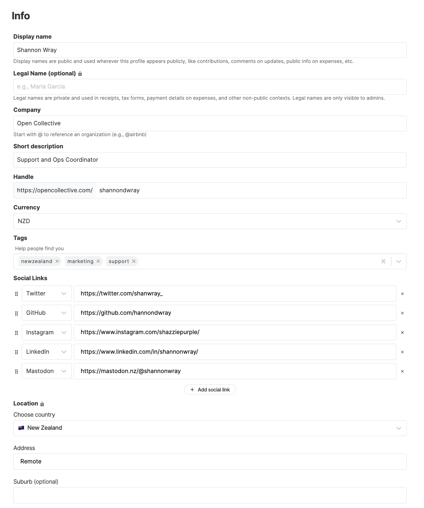

# User Profile


With the implementation of the new [Dashboard interface](https://docs.opencollective.com/help/product/understanding-your-dashboard), we are currently in the process of updating our documentation and some pages may be out of date. Thank you for your patience. Please [contact](https://opencollective.com/contact) our support team if you need any assistance.


## Your profile

You can use your Open Collective user profile to let people know a bit about you. Projects you back might want to reach out to you, or you may want to use this page to show off your contributions or the Collectives you manage.

You can access your profile settings by using the dropdown menu on your username and going to the **Profile** page.

On your **Profile** page, you are able to customize the following:

### Cover image

The optimal size for a cover image is 2736x650.&#x20;

.jpg>)

Click on **Edit cover** to access to upload a new cover image.

After uploading an image, you are able to adjust it as you wish by either moving it and zooming in and out.

.gif>)

### Main color

You can either choose any of the preset colors, add your own custom color or reset to the default color.

## User Settings

To modify other profile information, click on the gear icon next to your profile image.

<figure><figcaption></figcaption></figure>

Here you can edit basic info such as **Display** **Name**, **Legal Name,** **Company**, **Short description** and **Handle.** Add your **Currency** and **Tags, Social Links** and your **Location**.&#x20;

Access other settings such as **Profile Page**, **Payment Methods**, **Payment Receipts**, **Gift Cards**, **Webhooks, Authorised Apps, Two-factor authentication, For developers** and **Advanced**.

## Advanced settings

### Changing your email address

Go to **Advanced** and specify your new email address in the box under the **Email address** section. You'll get a confirmation, and then your new email will be active.

### Deleting your account


You can only delete your account if it has no activity registered such as donations and expenses. Therefore, accounts with a history of transactions cannot be deleted —they are part of Collective budgets and their integrity and accuracy depend on those records. You may archive your account instead.


To delete your account, go to the **Delete this Account** section and click on **Delete this account**.

### Archiving your account

If your account has a history of transactions, your only option is archiving your account. Archived accounts will appear as inactive accounts and no new activity will be allowed. The next time subscriptions are due to be renewed (1st of the month), they will be cancelled.

To archive your account, go to the **Archive this Account** section and click on **Archive this account**.

## Using Open Collective Anonymously

We understand that not everyone can or wants to show their real name on public Collective budgets.

If you are getting paid through the platform, we will need some personally identifiable information. Including your legal name. We will also need some documents, invoices and tax forms, these documents are not availably to the public, only admins of Collectives you work withwill be able to see them.

### Adding Your Legal Name

Your legal name identifies you to admins of Collectives you work with, to Hosts of Collectives you work with and some staff at Open Collective Inc. the company that operates the Open Collective platform. \
\
You can add your legal name to your profile alongside your Display name. These are both editable in your [User Settings](user-profile.md#other-settings)

### Update/Change your Email

Head to your User Settings, either via the settings button on your profile or in the user menu.&#x20;

Go to the Advanced Section&#x20;

Update/Change your email and click the save button
